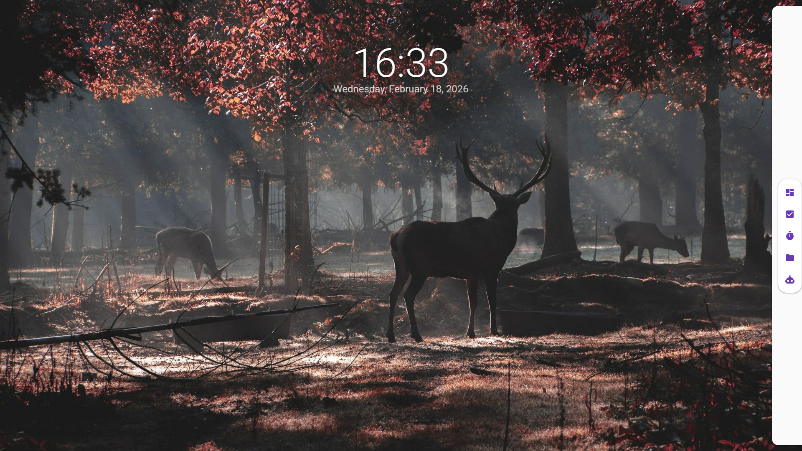

# FocusPanel (桌面专注面板)

> **"让桌面回归专注，让工具触手可及。"**

FocusPanel 是一个基于 **C#** 和 **WPF** 构建的高性能、低占用的现代化桌面增强工具。它致力于接管并优化你的桌面体验，从杂乱无章的文件堆积中解放你的生产力。

---

## 💡 设计理念 (Philosophy)

1.  **高性能与低占用 (High Performance & Lightweight)**
    *   我们深知桌面工具不应拖慢系统速度。FocusPanel 经过精心优化，确保在后台运行时资源占用极低，而在前台交互时流畅丝滑。

2.  **桌面即服务 (Desktop as a Service)**
    *   传统的桌面往往是文件的"临时存放站"。FocusPanel 将桌面转化为一个智能的、可交互的**工作台**。
    *   **自动托管**：它能自动收纳桌面上的所有文件和快捷方式，让你无需手动整理即可保持整洁。

3.  **AI 驱动的交互 (AI-First)**
    *   未来的交互是自然的。FocusPanel 开放了所有功能接口给 AI，你可以通过自然语言指挥它完成任务管理、桌面整理等复杂操作。

---

## ✨ 核心功能 (Features)

### 1. 🗂️ 桌面图标与文件收纳 (Desktop Organizer)
*   **开机自启 & 自动托管**：无缝接管桌面，自动扫描并收纳所有文件、文件夹及快捷方式。
*   **自定义分区 (Custom Partitions)**：支持创建不同的分区（如"工作"、"媒体"、"临时"），将文件分类存放。
*   **艺术化 UI (Artistic UI)**：告别枯燥的列表，提供精美的图标展示和布局，让桌面成为一种视觉享受。

### 2. ✅ 多项目任务管理 (Task Management)
*   **多项目支持**：轻松管理多个并行项目，清晰划分工作与生活。
*   **任务提醒**：内置提醒功能，确保你不会错过任何重要事项。
*   **持久化存储**：所有数据本地安全存储，随时查看历史记录。

### 3. 🍅 番茄钟 (Pomodoro Focus)
*   **沉浸式专注**：内置番茄工作法计时器，帮助你保持心流状态。
*   **统计分析**：记录你的专注时长，可视化你的效率提升。

### 4. 🤖 AI 智能接口 (AI Interface)
*   **自然语言控制**：通过 AI 接口，你可以直接说："帮我把桌面上的图片整理到图片文件夹" 或 "创建一个明天下午 3 点的会议提醒"。
*   **智能规划**：AI 可以读取你的任务列表，为你生成合理的每日计划。
*   **开放架构**：面板的所有功能结构（任务、文件、设置）均向 AI 开放调用能力，赋予 AI 真实的执行力。

---

## 🛠 技术架构 (Architecture)

本项目采用标准的 **MVVM (Model-View-ViewModel)** 架构，确保代码的可维护性和扩展性。

*   **语言**: C#
*   **框架**: .NET 7 / .NET 8 (WPF)
*   **架构模式**: MVVM
*   **UI 组件**: MaterialDesignInXamlToolkit (Google Material Design 风格)
*   **数据存储**: SQLite (Entity Framework Core)

---

## 🚀 快速开始 (Getting Started)

### 环境要求
*   Windows 10 或 Windows 11
*   .NET 7 SDK 或更高版本

### 运行步骤
1.  克隆仓库到本地。
2.  使用 Visual Studio 2022 打开解决方案。
3.  还原 NuGet 包并构建项目。
4.  运行 `FocusPanel` 项目。

---

## ✅ 开发进度 (Development Status)

### 已实现 (Implemented)
- [x] **基础架构**: MVVM (CommunityToolkit), SQLite (EF Core), Material Design UI。
- [x] **主界面**: 透明背景窗口, 中央时钟显示, 侧边栏交互框架。
- [x] **任务管理**: 基础的任务增删改查 (CRUD), 数据持久化。

### 待办事项 (To-Do List)

#### 1. 🗂️ 桌面图标与文件收纳 (Desktop Organizer)
- [ ] **核心逻辑**: 实现桌面文件扫描与监视 (File Watcher)。
- [ ] **智能分类**: 开发基于文件类型/扩展名的自动分类算法。
- [ ] **自定义分区**: 实现可拖拽、可命名的桌面分区 UI。
- [ ] **开机自启**: 添加注册表或启动文件夹集成。

#### 2. ✅ 多项目任务管理 (Task Management)
- [ ] **多项目支持**: 数据库模型添加 Project/Category 字段，支持任务分组。
- [ ] **任务提醒**: 集成 Windows Toast Notification 实现定时提醒。
- [ ] **截止日期**: 添加 DatePicker 支持任务截止时间设置。

#### 3. 🍅 番茄钟 (Pomodoro Focus)
- [ ] **倒计时逻辑**: 实现精确的倒计时器 (Timer)。
- [ ] **状态管理**: 工作/短休息/长休息 状态切换。
- [ ] **统计图表**: 可视化展示每日专注时长。

#### 4. 🤖 AI 智能接口 (AI Interface)
- [ ] **API 集成**: 接入 OpenAI / Azure OpenAI / Local LLM 接口。
- [ ] **对话界面**: 实现类似 Chat GPT 的对话 UI。
- [ ] **Function Calling**: 封装本地方法 (CreateTask, OrganizeFiles) 供 AI 调用。

#### 5. 🛠 系统与优化
- [ ] **托盘图标**: 完善系统托盘菜单与交互。
- [ ] **鼠标穿透**: 优化透明区域的鼠标事件穿透，确保不影响桌面壁纸交互。
- [ ] **性能优化**: 降低后台内存占用。
