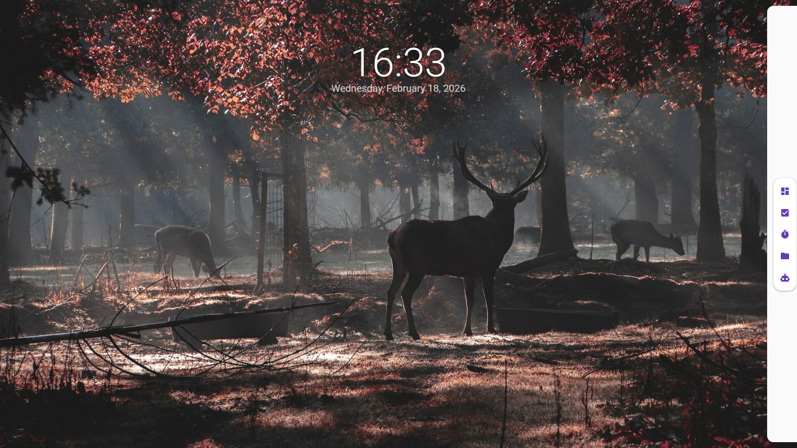

# FocusPanel

> 桌面专注面板 — 一个集成任务管理、番茄钟、文件收纳和 OKR 目标的 WPF 桌面应用。



---

## 功能

### 桌面文件收纳
- 扫描桌面文件，支持拖拽到自定义分区进行归类
- 拖入分区时自动隐藏桌面图标（文件保留在桌面，`FileAttributes.Hidden`）
- 自定义分区：创建、重命名、删除、拖拽排序
- 网格/列表双视图，图标尺寸可调
- 时间线视图按日期分组
- 一键隐藏/显示所有桌面图标（全局开关）
- Rescue 工具：批量整理散落文件

### 任务管理
- 多项目支持，项目内包含子任务
- 看板和列表双视图
- 自定义字段（文本、日期、下拉等）
- 任务状态流转

### 番茄钟
- 工作 / 短休息 / 长休息 状态切换
- 专注时长统计与记录
- 独立悬浮窗模式

### OKR 目标管理
- 创建和管理 Objectives 与 Key Results
- 飞书（Feishu）OKR API 双向同步
- 同步状态追踪：`Synced` / `LocalCreated` / `LocalModified` / `LocalDeleted`
- 可配置自动同步间隔

### AI 助手
- 聊天式 AI 交互界面
- 接口预留：任务、文件、OKR 数据均可通过 `IOkrDataProvider` 等接口向 AI 暴露

---

## 技术栈

| 层面 | 技术 |
|------|------|
| 语言 / 框架 | C# / .NET 7.0 / WPF |
| 架构 | MVVM（CommunityToolkit.Mvvm 源生成器） |
| UI | MaterialDesignInXamlToolkit |
| 数据库 | SQLite（EF Core 7，手动迁移） |
| 系统托盘 | Hardcodet.NotifyIcon.Wpf |
| Markdown 渲染 | Markdig.Wpf |

---

## 项目结构

```
FocusPanel/
├── Views/           # WPF 窗口和用户控件（.xaml + .xaml.cs）
├── ViewModels/      # MVVM ViewModel（MainViewModel 为导航中枢）
├── Models/          # EF Core 实体（TodoItem, DesktopFile 等）和 DTO
├── Services/        # 业务逻辑（FileOrganizer, Task, OkrSync 等）
├── Data/            # AppDbContext — SQLite 上下文 + EnsureSchema()
├── Helpers/         # Win32 互操作（DesktopHelper, IconHelper）
└── Converters/      # WPF IValueConverter 实现
```

---

## 构建 & 运行

```bash
# 构建
dotnet build FocusPanel.csproj

# 运行
dotnet run --project FocusPanel.csproj
```

要求：Windows 10/11，.NET 7.0 SDK。无 `.sln` 文件，直接用 `.csproj`。

---

## 面板行为

- **仅桌面可见**：通过 `SetWinEventHook(EVENT_SYSTEM_FOREGROUND)` 监听前台窗口。只有桌面或任务栏前台时面板才显示，切换至浏览器等应用时自动隐藏
- 位于屏幕右侧，80px 收缩 / 800px 展开，无动画即时切换
- 鼠标悬停展开，离开收起（有键盘焦点时保持展开）
- 关闭即隐藏到系统托盘，`ForceClose()` 为唯一真正退出路径
- `%APPDATA%/FocusPanel/focuspanel.db` 为数据库路径，`EnsureSchema()` 处理建表和迁移
